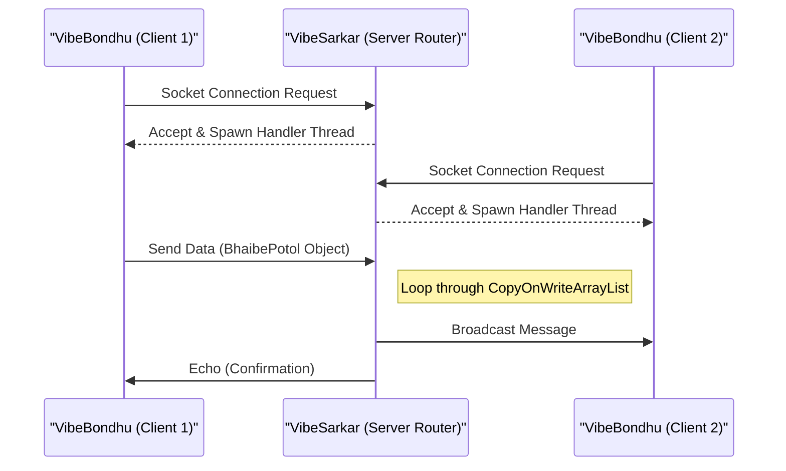

# Zava-Socket-Sync

A lightweight, multithreaded peer-to-peer data router and synchronization system built entirely using Core Java (JDK). This project demonstrates low-level socket programming, multithreaded concurrency management, and custom communication protocols without the use of external frameworks.

## 🎯 Purpose
To showcase fundamental backend engineering skills—specifically TCP/IP socket programming, concurrent thread management, and the `java.net`/`java.io` packages—by building a real-time messaging system from scratch.

## 📸 Architecture & Workflow



## ✨ Features
*   **Multithreaded Boss Router (`VibeSarkar`)**: A central server that handles concurrent client connections using a thread-per-connection architecture.
*   **Asynchronous Peer Clients (`VibeBondhu`)**: Clients utilize separate threads for non-blocking message listening and broadcasting, ensuring the UI/input stream never blocks incoming messages.
*   **Thread-Safe State Management**: Utilizes `CopyOnWriteArrayList` to ensure safe, concurrent broadcast operations across multiple client threads without `ConcurrentModificationException`.
*   **Custom Communication Protocol**: Implements persistent TCP streams using `BufferedReader` and `PrintWriter`, including a custom `ulta:` command prefix to broadcast reversed messages.

## 💻 Code Style Note
*This project intentionally features "weird code" formatting and non-English variable names (e.g., `VibeSarkar` for Server, `VibeBondhu` for Client) as a stylistic experiment. The underlying Java implementation strictly adheres to object-oriented and concurrency best practices.*

## ⚙️ Setup & Installation

### Prerequisites
*   Java Development Kit (JDK) 8+

### 1. Compilation
Compile all source files:
```bash
javac *.java
```

### 2. Execution
**Start the Router (Server):**
```bash
java VibeSarkar
```
*(The server will start listening for connections on port 8080).*

**Start Peer Clients:**
Open multiple terminals and run the client in each:
```bash
java VibeBondhu
```

**Usage:**
- Type any message to broadcast it to all other connected peers.
- Type `ulta:hello` to broadcast the message in reverse ("olleh").
- Type `exit` to cleanly close the socket and terminate the thread.

---
*Created by [Shahid](https://github.com/12345Shahid)*
